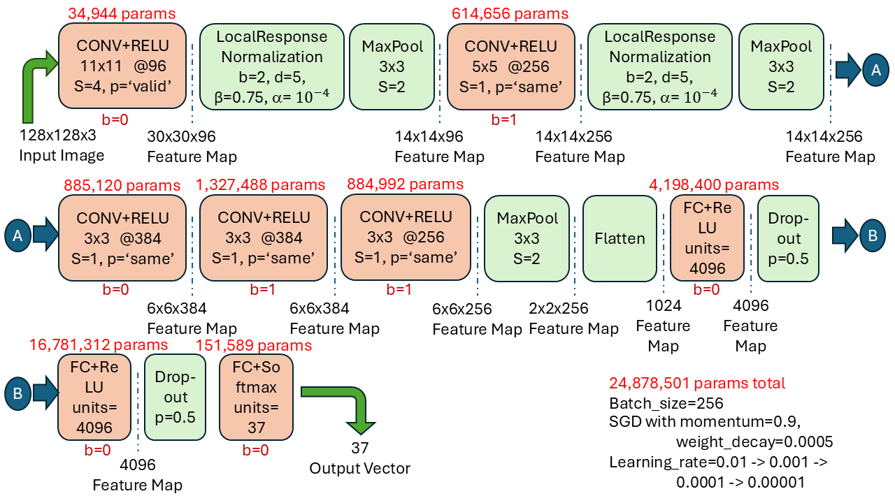

# p009-alexnet-cnn-model
AlexNet model and its variations is trained on OxfordiiiT pet dataset in TensorFlow framework. Effect of L2 regularization and BatchNorm in tuning model is observed. 

# Dataset and Split
The Oxford-IIIT pet dataset is a 37 category pet image dataset with roughly 200 images for each class. Data has 7349 images of pets and is split into 85:15 train/test data respectively.
# Data Augmentation
Data augmentation plays important part in training model especially when data is limited. Dataset size is increased by 6 fold via augmentation techniques in file [tf_ata_augmentation](tf_data_augmentation.py). Original images are concatenated with central and corners crop. Central, top left, top right, bottom left, bottom left crops are additionally preprocessed by left_right_flip, random_hue, random_brightness, random_saturation, random_contrast; respectively. Moreover, corner crops are randomly left_right flipped using different seeds.
# AlexNet Architecture
The architecture of original AlexNet is below. L2 regularization and dropout was used to overcome overfitting. Today, we mostly use BatchNormalization in modified AlexNet but at time of AlexNet LocalResponseNormalization was used. Also, in original architecture as seen in figure below, biases of inner convolution layer are initialized with one while all other layers with zero. 
 
# AlexNet and its variants experimented
AlexNet archituecture is used on this data set. Data is very small so it performed poor. Here, different initializations, L2 regularizations, BatchNormalization (in place of LocalResponseNormalization) and optimization algorithms(SDG with momentum, Adam optimizier) are iteratively applied to find best performance when training from scratch.
  Filename indicates the variation and is explained in below table:

| filename | explanation |
|:-------|:-------|
| [0_org_alexnet_sgd](0_org_alexnet_sgd.ipynb) | Original AlexNet architecture with SGD momentum optimizer |
| [0_org_alexnet_bias_0_sgd](0_org_alexnet_bias_0_sgd.ipynb) | Original AlexNet architecture with SGD momentum optimizer but all biases are zero initialized |
| [0_org_alexnet_bias_0.1_sgd](0_org_alexnet_bias_0.1_sgd.ipynb) | Original AlexNet architecture with SGD momentum optimizer but all biases are initialized with 0.1 |
| [0_org_alexnet_bias_1_sgd](0_org_alexnet_bias_1_sgd.ipynb) | Original AlexNet architecture with SGD momentum optimizer but all biases are initialized with one |
| [0_org_alexnet_bias_lecunn_uniform_sgd](0_org_alexnet_bias_lecunn_uniform_sgd.ipynb) | Original AlexNet architecture with SGD momentum optimizer but all biases are uniform LeCun initialized |
| [1_alexnet_bn2_bias_0.1_sgd](1_alexnet_bn2_bias_0.1_sgd.ipynb) | AlexNet architecture but BatcNorm used (in place of LRN) with SGD momentum optimizer and biases are initialized with 0.1 |
| [1_alexnet_bn2_bias_0.1_adam](1_alexnet_bn2_bias_0.1_adam.ipynb) | AlexNet architecture but BatcNorm used (in place of LRN) with Adam optimizer and biases are initialized with 0.1 |
| [1_alexnet_bn2_bias_lecunn_uniform_sgd](1_alexnet_bn2_bias_lecunn_uniform_sgd.ipynb) | AlexNet architecture but BatcNorm used (in place of LRN) with SGD momentum optimizer and biases are uniform LeCun initialized |
| [1_alexnet_bn2_bias_lecunn_uniform_adam](1_alexnet_bn2_bias_lecunn_uniform_adam.ipynb) | AlexNet architecture but BatcNorm used (in place of LRN) with Adam optimizer and biases are uniform LeCun initialized |
| [2_alexnet_bn_conv_bias_0.1_sgd](2_alexnet_bn_conv_bias_0.1_sgd.ipynb) | AlexNet architecture but BatcNorm used (in place of LRN and after every convolution layer) with SGD momentum optimizer and biases are initialized with 0.1 |
| [2_alexnet_bn_conv_bias_0.1_adam](2_alexnet_bn_conv_bias_0.1_adam.ipynb) | AlexNet architecture but BatcNorm used (in place of LRN and after every convolution layer) with Adam optimizer and biases are initialized with 0.1 |
| [2_alexnet_bn_conv_bias_lecunn_uniform_sgd](2_alexnet_bn_conv_bias_lecunn_uniform_sgd.ipynb) | AlexNet architecture but BatcNorm used (in place of LRN and after every convolution layer) with SGD momentum optimizer and biases are uniform LeCun initialized |
| [2_alexnet_bn_conv_bias_lecunn_uniform_adam](2_alexnet_bn_conv_bias_lecunn_uniform_adam.ipynb) | AlexNet architecture but BatcNorm used (in place of LRN and after every convolution layer) with Adam optimizer and biases are uniform LeCun initialized |

**Note**: In this project, weights/kernels of all layers using RELU are initialized with He iniatialization while softmax is Glorot initialized. Although original AlexNet was randomly inialized but later it was proved that certain initialization yield faster convergence.

# AlexNet Variations Result Summary
First of all, original AlexNet architecture with SGD momentum was trained as in file [0_org_alexnet_sgd](0_org_alexnet_sgd.ipynb). It was too slow and difficult to train so stopped after sometime(20 min). $\approx$ 9% accuracy was achieved yet. Then, diffrent biases's initializtion was tested. Among them, 0.1 and LeCun gave slight better results with 12% and 11% accuracy, respectively. But again training progress was slow. Modifying architecture to use L2 reBatchNorm inplace of "Local Response Normalization" layer boosted accuracies but with only Adam optimizer. [**1_alexnet_bn2_bias_0.1_adam**](1_alexnet_bn2_bias_0.1_adam.ipynb) achieved best result in experimentations with $\approx$ 32% accuracy.

Futher, modifying architecture to include BatchNorm after every convolution layer tied second best score but with SGD algorithm only. It achieved $\approx$ 31% but weirdly Adam optimizer performance decreased to 26%. Below table contains more information about these experimentations:

|  file_name.ipynb | train_acc | val_acc | reg_val | lr | epoch | train_loss | val_loss |
|:-------|:-------:|:-------:|:-------:|:-------|:-------:|:-------:|:-------:|
| [0_org_alexnet_sgd](0_org_alexnet_sgd.ipynb)    | 7.13 | 9.99 | 0.0005   | 0.0001,0.00005,0.00001 | 20,10,10 | 12.741 | 12.9118 |
| [0_org_alexnet_bias_0_sgd](0_org_alexnet_bias_0_sgd.ipynb)                    | 6.67 | 9.63 | 0.0005 | 0.0001, 0.00001 | 20, 5 | 13.0481 | 12.9803 |
| [0_org_alexnet_bias_0.1_sgd](0_org_alexnet_bias_0.1_sgd.ipynb)                  | 12.8811 | 12.7422 | 0.0005 | 0.0001,0.00005,0.000001 | 20,10,10 | 12.8811 | 12.7422 |
| [0_org_alexnet_bias_1_sgd](0_org_alexnet_bias_1_sgd.ipynb)                  | 6.77 | 10.08 | 0.0005 | 0.0001,0.00001 | 20,10 | 13.0224 | 12.9592 |
| [0_org_alexnet_bias_lecunn_uniform_sgd](0_org_alexnet_bias_lecunn_uniform_sgd.ipynb)                | 8.25 | 11.53 | 0.0005 | 0.0001,0.00005, 0.000001 | 20,10, 10 | 12.9281 | 12.8260 |
| [1_alexnet_bn2_bias_0.1_sgd](1_alexnet_bn2_bias_0.1_sgd.ipynb)              | 11.42 | 15.62 | 0.0005 | 0.0001,0.00005,0.00001 | 20,10,10 | 12.7815 | 12.6360 |
| [**1_alexnet_bn2_bias_0.1_adam**](1_alexnet_bn2_bias_0.1_adam.ipynb)  | 34.08 | **32.43** | 0.01 | 0.00005,0.000001, 0.0000005 | 6,12, 6 | 47.9976 | 47.8763 |
| [1_alexnet_bn2_bias_lecunn_uniform_sgd](1_alexnet_bn2_bias_lecunn_uniform_sgd.ipynb)| 12.26| 14.08 | 0.0005 | 0.0001,0.00005,0.00001 | 20,10,10 | 12.7542 | 12.6350 |
| [**1_alexnet_bn2_bias_lecunn_uniform_adam**](1_alexnet_bn2_bias_lecunn_uniform_adam.ipynb)      | 32.93 | 31.15 | 0.01 | 0.00005,0.000001, 0.0000005 | 6,12, 6 | 47.2598 | 47.1154 |
| [2_alexnet_bn_conv_bias_0.1_sgd](2_alexnet_bn_conv_bias_0.1_sgd.ipynb)    | 30.68 | 30.34 | 0.005 | 0.0005,0.00001, 0.000005 | 12,6, 6 | 78.1883 | 78.2204 |
| [2_alexnet_bn_conv_bias_0.1_adam](2_alexnet_bn_conv_bias_0.1_adam.ipynb)    | 27.58 | 25.70 | 0.01 | 0.00005,0.000001, 0.000001,0.0000005 | 6,6, 6,6 | 85.8033 | 85.6165 |
| [**2_alexnet_bn_conv_bias_lecunn_uniform_sgd**](2_alexnet_bn_conv_bias_lecunn_uniform_sgd.ipynb)  | 32.44 | 31.15 | 0.005 | 0.0005,0.00005,0.000005 | 16,6,6 | 77.5226 | 77.6138 |
| [2_alexnet_bn_conv_bias_lecunn_uniform_adam](2_alexnet_bn_conv_bias_lecunn_uniform_adam.ipynb)              | 28.26 | 27.07 | 0.01 | 0.00005,0.000001, 0.0000005 | 6,12, 6 | 82.5631 | 82.3742 |

